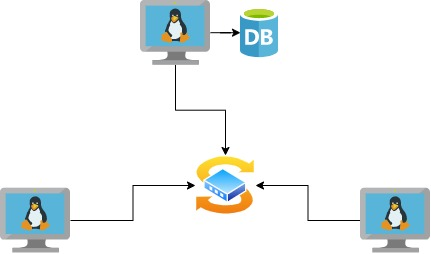

# Linux Cluster Monitoring Agent

## Introduction
The Jarvis team has a Linux cluster of 10 servers running CentOS 7 which are connected through a switch and communicate through IPv4 addresses.
The objective of this project is to design and implement a solution that allows recording the hardware specifications of each node and monitoring node resource usage in real-time and stored in a Relational Data Base System (RDBMS).
This solution will help the resource planning team as they will be able to use the data to generate reports.
The implementation of the program required to use Linux command lines, Bash scripts, PostgreSQL and docker.

## Quick Start
- Start a psql instance using psql_docker.sh
```
sudo systemctl status docker
```
- Create tables using ddl.sql
```
CREATE TABLE PUBLIC.host_info ();
CREATE TABLE PUBLIC.host_usage ();
```
- Insert hardware specs data into the DB using host_info.sh
```
INSERT INTO host_info (column names) VALUES(values);
```
- Insert hardware usage data into the DB using host_usage.sh
```
INSERT INTO host_usage (column names) VALUES(values);
```
- Crontab setup
```
crontab -e
* * * * * bash /home/centos/dev/jrvs/bootcamp/linux_sql/host_agent/scripts/host_usage.sh localhost 5432 host_agent postgres password > /tmp/host_usage.log
```

## Implemenation
The first step of the implementation is setting up a psql instance using docker so I can use it on my computer during the development. To do this, I created a feature branch called psql_docker where I run the docker server. Inside the docker, I installed a psql CLI client. With this, I was able to connect to a psql instance.

The second step was to collect the hardware information and resource usage from each cluster. I collected the following information from the hardware: hostname, CPU number, CPU architecture, CPU model, CPU mhz, l2 cache, total memory and time stamp. From the resource usage, was the following data: memory free, CPU idle, CPU kernel, disk io and disk available. I used CLI to obtain each data point and I stored it in a column that it would be used later.

The third step was to create two tables to store the hardware specifications and resource usage data to perform data analytics. These two tables were named host_info and host_usage and were created into the data bae host_agent within the psql instance.

The fourth step was to create a program that was installed on each server to collect hardware specifications and resource usage data automatically. This program is called a monitoring agent and consisted of two scripts: host_info.sh and host_usage.sh. The first of them collected hardware specifications data and the other one collected server usage data. Both data were inserted into the psql database.

The last step was to deploy the monitoring app and see the information collected before. I used crontab to execute the host_usage.sh script every minute.

## Architecture



## Scripts
Shell script description and usage (use markdown code block for script usage)
- psql_docker.sh
```
start/stop the psql container
```
- host_info.sh
```
collect hardware specifications data
```
- host_usage.sh
```
collect server usage data
```
- crontab
```
deploy the monitoring app to collect the data
```

## Database Modeling
Describe the schema of each table using markdown table syntax (do not put any sql code)
- `host_info` 

  | Column           | Type      |
  |------------------|-----------|
  | id               | Serial    |
  | hostname         | Varchar   |
  | cpu_number       | Int2      |
  | cpu_architecture | Varchar   |
  | cpu_model        | Varchar   |
  | cpu_mhz          | Float8    |
  | l2_cache         | Int4      |
  | timestamp        | Timestamp |
  | total_mem        | Int3      |

- `host_usage`

  | Column         | Type      |
  |----------------|-----------|
  | timestamp      | Timestamp |
  | host_id        | Serial    |
  | memory_free    | Int4      |
  | cpu_idel       | Int2      |
  | cpu_kernel     | Int2      |
  | disk_io        | Int4      |
  | disk_available | Int4      |

## Test
The program was tested by using SQL queries to retrieve the data stored in the tables.
It gave successful results.

## Deployment
The app was deployed using crontab which was executed every minute to collect data continuously.

## Improvements
- Automate the creation of new columns in the tables when new information is required.
- Make the program scalable for future business needs.
- Give access to other business users so they can extract the information they need.
